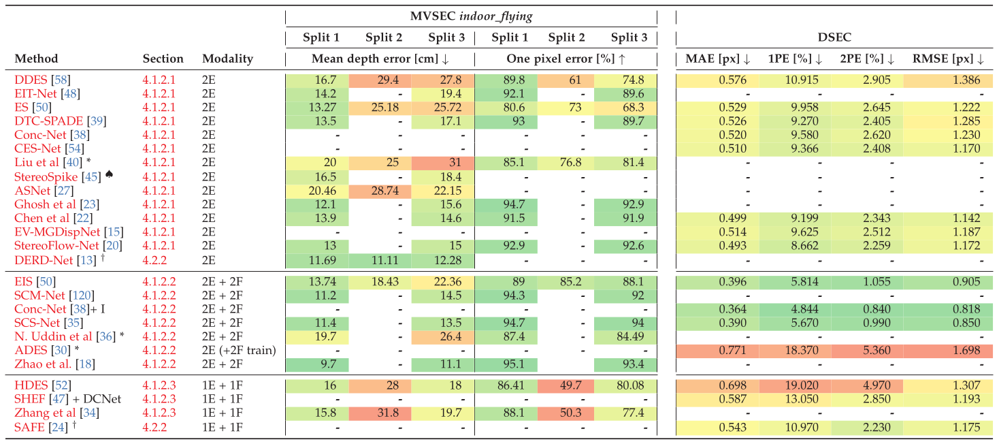

# Event-based Stereo Depth Estimation: A Survey

Official repository for **Event-based Stereo Depth Estimation: A Survey**, by [Suman Ghosh](https://www.linkedin.com/in/suman-ghosh-a8762576/) and [Guillermo Gallego](http://www.guillermogallego.es), published at **XXX 2024**.
<h2 align="left">
  
[Paper](https://arxiv.org/pdf/2409.17680) 
| [Table of Methods](https://docs.google.com/spreadsheets/d/1DfmVXdg3H9iaLpkXNm5ygB6ald9dK0ggO0rUDXEDTXE)
| [Table of Datasets](https://docs.google.com/spreadsheets/d/1DfmVXdg3H9iaLpkXNm5ygB6ald9dK0ggO0rUDXEDTXE/edit#gid=1539773438&range=A1)
</h2>

[](https://docs.google.com/spreadsheets/d/1DfmVXdg3H9iaLpkXNm5ygB6ald9dK0ggO0rUDXEDTXE)

[](https://docs.google.com/spreadsheets/d/1DfmVXdg3H9iaLpkXNm5ygB6ald9dK0ggO0rUDXEDTXE/edit#gid=1539773438&range=A1)

If you use this work in your research, please cite it as follows:

```bibtex
@article{Ghosh24survey,
  author = {Suman Ghosh and Guillermo Gallego},  
  title = {Event-based Stereo Depth Estimation: A Survey},
  journal = {(under review)},
  year = {2024}
}
```

# Our works on Event-based 3D Reconstruction

## Stereo
* Stereo Event-based Spatial AI (2025). PhD Thesis at TU Berlin.
* [DERD-Net: Learning Depth from Event-based Ray Densities (2025)](https://arxiv.org/pdf/2504.15863)
* [ES-PTAM: Event-based Stereo Parallel Tracking and Mapping (ECCVW 2024)](https://github.com/tub-rip/ES-PTAM)
* [Secrets of Event-Based Optical Flow, Depth and Ego-Motion Estimation by Contrast Maximization (TPAMI 2024). (Stereo in Sec. IV-E)](https://doi.org/10.1109/TPAMI.2024.3396116)
* [MC-EMVS: Multi-Event-Camera Depth Estimation and Outlier Rejection by Refocused Events Fusion (AISY 2022)](https://github.com/tub-rip/dvs_mcemvs)
* [ESVO2: Direct Visual-Inertial Odometry with Stereo Event Cameras (TRO 2025)](https://github.com/NAIL-HNU/ESVO2)
* [ESVO: Event-based Stereo Visual Odometry (TRO 2021)](https://sites.google.com/view/esvo-project-page/home), including cleaned **Stereo Dataset (DAVIS240C)**.
* [Semi-dense 3D Reconstruction with a Stereo Event Camera (ECCV 2018)](https://rpg.ifi.uzh.ch/ECCV18_stereo_davis.html), including **Stereo Dataset (DAVIS240C)**.

## Monocular
* [Secrets of Event-Based Optical Flow, Depth and Ego-Motion Estimation by Contrast Maximization (TPAMI 2024). (Monocular in Sec. IV-D)](https://doi.org/10.1109/TPAMI.2024.3396116)
* [EDS: Event-aided Direct Sparse Odometry (CVPR 2022)](https://rpg.ifi.uzh.ch/eds.html)
* [ESL: Event-based Structured Light (3DV 2021)](https://rpg.ifi.uzh.ch/eds.html)
* [Focus Is All You Need: Loss Functions for Event-based Vision (CVPR 2019)](http://rpg.ifi.uzh.ch/docs/CVPR19_Gallego.pdf)
* [A Unifying Contrast Maximization Framework for Event Cameras, with Applications to Motion, Depth and Optical Flow Estimation (CVPR 2018)](http://rpg.ifi.uzh.ch/docs/CVPR18_Gallego.pdf)
* [EVO: Event based Visual Odometry (RAL 2017)](https://github.com/uzh-rpg/rpg_dvs_evo_open/)
* [EMVS: Event-based Multi-View Stereo (BMVC 2016, IJCV 2018)](https://github.com/uzh-rpg/rpg_emvs)
* [Low-Latency Visual Odometry using Event-based Feature Tracks (IROS 2016)](https://youtu.be/RDu5eldW8i8)


## Additional Resources on Event-based Vision
* [Research page (TU Berlin, RIP lab)](https://sites.google.com/view/guillermogallego/research/event-based-vision)
* [Course at TU Berlin](https://sites.google.com/view/guillermogallego/teaching/event-based-robot-vision)
* [Event-based Vision: A Survey](http://rpg.ifi.uzh.ch/docs/EventVisionSurvey.pdf)
* [List of Resources](https://github.com/uzh-rpg/event-based_vision_resources)
